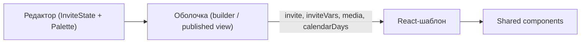

# Контракт данных шаблона приглашения

Документ описывает, **какую информацию пользователь настраивает в редакторе** и **как шаблон обязан её потреблять**. Источник правды в коде: `frontend/src/lib/invite-template-contract.ts`.

## Архитектура



| Слой | Ответственность |
|------|-----------------|
| `InviteState` | Тексты, даты, программа, RSVP, медиа-URL, настройки музыки |
| `InviteSitePalette` → `InviteVars` | Цвета через CSS custom properties |
| `InviteTemplate` | Метаданные каталога: id, coverType, defaultPaletteId, recommendedPaletteIds |
| React-шаблон | Вёрстка секций, анимации, композиция |

## Секции приглашения

| ID | Название | Обязательна | Содержимое |
|----|----------|-------------|------------|
| `hero` | Обложка | да | groom, bride, date, cover, music |
| `greeting` | Приветствие | да | lead |
| `when` | Когда | да | date, time, calendarDays |
| `where` | Где | да | venue, address, city, venueImage |
| `program` | Программа | да | schedule[] |
| `dress-code` | Дресс-код | да | dressCode, dressCodeColors |
| `rsvp` | RSVP | нет | showRsvp, rsvpDate, rsvpText, rsvpQuestions |
| `closing` | Финал | да | portraitImage, groom, bride |

## Поля `InviteState`

Полная таблица с типами, ограничениями и usage — в `inviteContentFields` (`invite-template-contract.ts`).

Ключевые ограничения редактора:

- `schedule`: 1–10 пунктов
- `dressCodeColors`: 1–8 hex-цветов
- `rsvpQuestions`: 0–8 вопросов, каждый ≥ 2 options
- `date`, `rsvpDate`: ISO `YYYY-MM-DD`
- `time`: `HH:MM`
- `ringMetal`: `"0"`–`"100"` (золото → серебро)

## CSS-переменные темы

| CSS var | Роль |
|---------|------|
| `--invite-bg` | Фон страницы |
| `--invite-surface` | Карточки |
| `--invite-ink` | Основной текст |
| `--invite-photo-text` | Текст на фото |
| `--invite-muted` | Вторичный текст |
| `--invite-accent` | Акценты |
| `--invite-line` | Линии / рамки |
| `--invite-veil` | Полупрозрачные слои |

## Shared components

| Блок | Компонент | Условие рендера |
|------|-----------|-----------------|
| Дресс-код | `InvitationDressCodeBlock` | всегда |
| RSVP | `InvitationRsvpForm` | `invite.showRsvp === true` |
| Музыка | `InvitationMusicPlayer` | `invite.musicEnabled === true` |

---

# Промпт для генерации шаблона (LLM)

Скопируйте блок ниже в чат с нейросетью. Параметры `{название}`, `{coverType}`, `{направление}` замените перед отправкой.

Также можно сгенерировать промпт из кода:

```ts
import { buildInviteTemplateGenerationPrompt } from "@/lib/invite-template-contract";

console.log(
  buildInviteTemplateGenerationPrompt({
    templateName: "Борdeaux evening",
    coverType: "arch",
    visualDirection: "Тёмно-бордовый бархат, золотая типографика, камерная атмосфера.",
  }),
);
```

---

## PROMPT START

```markdown
# Задача: сгенерировать шаблон свадебного приглашения

Ты создаёшь React-компонент шаблона для платформы **Invite**. Шаблон — это только визуальная оболочка: **весь пользовательский контент приходит из props**, его нельзя хардкодить.

## Стек и ограничения

- Next.js App Router, React 19, TypeScript.
- Стили: CSS Modules (`template.module.css`) и/или CSS custom properties из `inviteVars`.
- Анимации: `framer-motion` (как в существующих шаблонах).
- Иконки: `lucide-react`.
- Изображения: `next/image`; для runtime URL (`data:`, `/api/`) ставить `unoptimized`.
- Язык UI: русский. Локаль дат: `ru-RU`.
- Mobile-first, max-width оболочки ~520–640px по центру.
- Не добавляй бэкенд, API routes и изменения в MongoDB.

## Метаданные нового шаблона

- Название: **{название шаблона}**
- `coverType`: **{coverType}** (`rings` | `arch` | `wave`)
- Визуальное направление: {опишите стиль, настроение, референсы}

## Контракт пользовательских данных (`invite: InviteState`)

```ts
export type InviteScheduleItem = {
  description: string;
  time: string;
  title: string;
};

export type InviteRsvpQuestion = {
  options: string[];
  title: string;
  type: "multiple" | "single";
};

export type InviteState = {
  bride: string;
  groom: string;
  date: string;              // ISO YYYY-MM-DD
  time: string;              // HH:MM
  city: string;
  venue: string;
  address: string;
  lead: string;
  dressCode: string;
  dressCodeColors: string[]; // #RRGGBB, 1–8
  schedule: InviteScheduleItem[]; // 1–10
  showRsvp: boolean;
  rsvpDate: string;
  rsvpText: string;
  rsvpQuestions: InviteRsvpQuestion[]; // 0–8
  paletteId: string;           // не использовать в стилях напрямую
  ringMetal: string;           // "0"–"100", только coverType rings
  musicEnabled: boolean;
  musicTitle: string;
  musicUrl: string;
  coverImageUrl: string;
  portraitImageUrl: string;
  venueImageUrl: string;
};
```

### Обязательные секции

1. **Hero** — имена, дата, cover (`rings` / `arch` / `wave`)
2. **Greeting** — `invite.lead`
3. **When** — дата (`formatDate`), время, мини-календарь (`calendarDays`)
4. **Where** — venue, address, city, фото локации
5. **Program** — `schedule` (time + title; description опционально)
6. **Dress code** — shared component
7. **RSVP** — shared component, только если `showRsvp`
8. **Closing** — portrait + имена пары

### Форматирование дат

Импорт `@/lib/invite-date`:

- `formatDate(date)` → «14 сентября 2026 г.»
- `formatMonth(date)` → «СЕНТЯБРЬ»
- `getCalendarDays(date)` → 7 дней вокруг события, поле `selected`

## Контракт темы (`inviteVars`)

Применить на корне: `<article style={inviteVars}>`. Использовать только:

- `--invite-bg`, `--invite-surface`, `--invite-ink`, `--invite-photo-text`
- `--invite-muted`, `--invite-accent`, `--invite-line`, `--invite-veil`

## Props шаблона

```ts
type TemplateProps = {
  invite: InviteState;
  inviteVars: InviteVars;
  coverType: CoverType;
  coverImage: string;
  portraitImage: string;
  venueImage: string;
  calendarDays: Array<{ day: number; label: string; selected: boolean }>;
  ringColor: string; // coverType === "rings"
};
```

Fallback изображений: `inviteImages` из `@/lib/invite-theme`.

## Shared components (переиспользовать)

```tsx
import {
  InvitationDressCodeBlock,
  InvitationRsvpForm,
  InvitationMusicPlayer,
} from "@/invitation-templates/components";
```

## Структура файлов

```
frontend/src/invitation-templates/<slug>/
  template.tsx
  template.module.css
  index.ts
```

Регистрация: `defaultInviteTemplates`, `invitation-builder.tsx`, `published-invite-site.tsx`.

## Референсы в репозитории

Изучи перед генерацией:

- `frontend/src/invitation-templates/alpine/template.tsx` — rings/arch, календарь
- `frontend/src/invitation-templates/aqua/template.tsx` — wave cover
- `frontend/src/invitation-templates/vanilla/template.tsx` — arch, поп-арт

## Формат ответа

1. Концепция (3–5 предложений)
2. `template.tsx`
3. `template.module.css`
4. `index.ts`
5. JSON для `defaultInviteTemplates`
6. Фрагменты регистрации в builder / published view

Без TODO и без хардкода пользовательских текстов.
```

## PROMPT END
